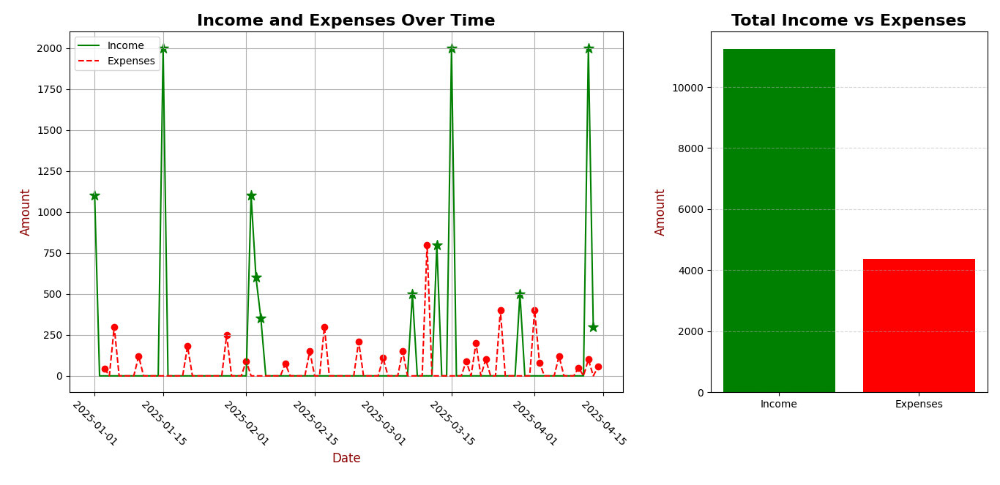
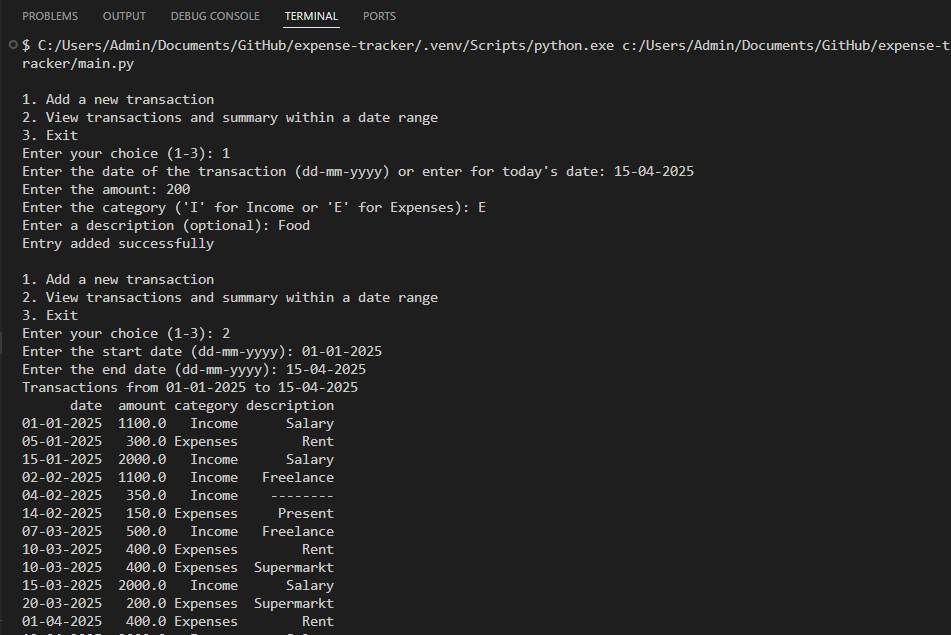
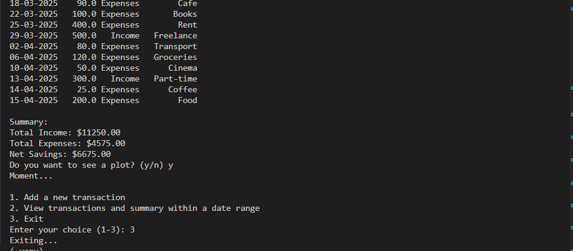

# 💸 Expense Tracker (CSV-based CLI)

A simple command-line tool to track your income and expenses using a CSV file.  
Includes visualizations of daily spending, bar charts, and summary statistics.

---

## 📸 Screenshots

### 📊 Example chart



### 💻 Terminal interaction




---

## 📝 Features

- **Add a transaction**: You can add a new transaction by providing the date, amount, category (Income/Expenses), and an optional description.
- **View transactions**: View all transactions in a specific date range along with a summary of total income, expenses, and net savings.
- **Visualize data**: Option to view a plot of daily income and expenses, as well as a bar chart comparing total income and expenses.
- **Data storage**: All transactions are saved in a CSV file (`finance_data.csv`), which can be opened in spreadsheet software.

---

## ⚙️ How to Use

- **Add a New Transaction**:

  - Select option `1` from the menu.
  - Follow the prompts to input your transaction details:
    - Date
    - Amount
    - Category (Income/Expenses)
    - Optional description

- **View Transactions**:

  - Select option `2`.
  - Enter the date range for which you want to view transactions.
  - The app will display a list of transactions and a summary of total income, expenses, and net savings.

- **Exit**:

  - Select option `3` to exit the program.

---

## 🗓️ Date Format

All dates must be entered in the format:

dd-mm-yyyy ✅ Example: `14-04-2025`

---

## 📊 Output Example

If you choose to view a plot, the app shows:

- 📈 Line chart: Daily income and expenses
- 📊 Bar chart: Total income vs. total expenses

You can customize marker types, colors, and layout in `plot_transactions.py`.

---

## 📁 Project Structure

```bash
expense-tracker/
│
├── main.py # CLI menu, CSV class, and add() function for user input
├── data_entry.py # Functions to get date, amount, category, etc.
├── plot_transactions.py # Matplotlib plot of income and expenses
├── finance_data.csv # Your saved transaction data
├── images/screenshots (optional)
└── README.md # This file
```

---

## 🛠️ Technologies Used

- Python 3.11+
- pandas
- matplotlib
- CSV for local data persistence
- Command Line Interface (CLI)

---

## 🧑‍💻 Requirements

The following Python packages are required to run the application. They can be installed using pip:

```bash
contourpy==1.3.1
cycler==0.12.1
fonttools==4.57.0
kiwisolver==1.4.8
matplotlib==3.10.1
numpy==2.2.4
packaging==24.2
pandas==2.2.3
pillow==11.2.1
pyparsing==3.2.3
python-dateutil==2.9.0.post0
pytz==2025.2
six==1.17.0
tzdata==2025.2
```

---

## 💾 Installation

1. Clone the repository:

```bash
git clone https://github.com/GannaKov/expense-tracker.git
   cd expense-tracker
```

2. Install the required dependencies:

```bash
pip install -r requirements.txt
```

3. Run the application:

```bash
python main.py
```
